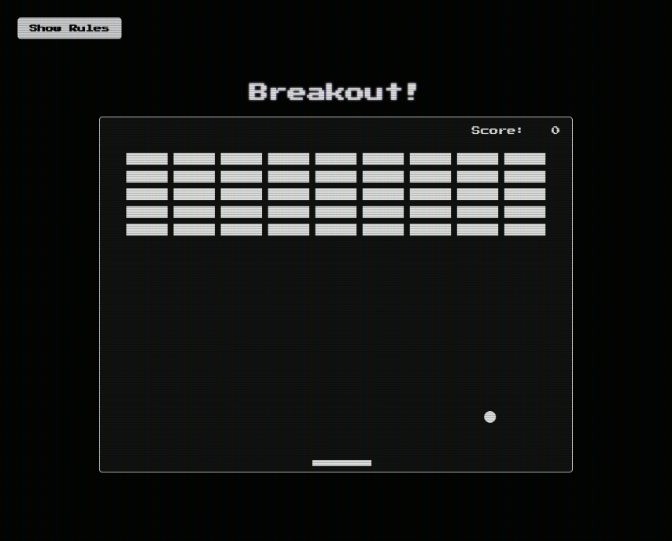
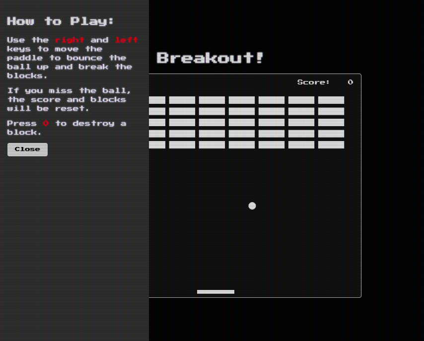

# Breakout - [Live Demo](https://rphase.github.io/justwebprojects/breakout-game/)

Game where you control a paddle with the arrow keys to bounce a ball up to break bricks. This app uses the HTML5 canvas element and API

## Project Specifications

1. Create canvas context
2. Create and draw ball
3. Create and draw paddle
4. Create bricks
5. Draw score
6. Add update() - Animate - requestAnimationFraome(callback)
7. Move the paddle with keyboard event handlers
8. Move ball
9. Add wall boundaries
10. Increase score when breaking bricks
11. Lose - Reset bricks and score
12. Add audio effects (Freesound)
13. Add assist function to destroy bricks

## References

https://developer.mozilla.org/en-US/docs/Web/API/Canvas_API

https://developer.mozilla.org/en-US/docs/Web/API/window/requestAnimationFrame

https://aleclownes.com/2017/02/01/crt-display.html
