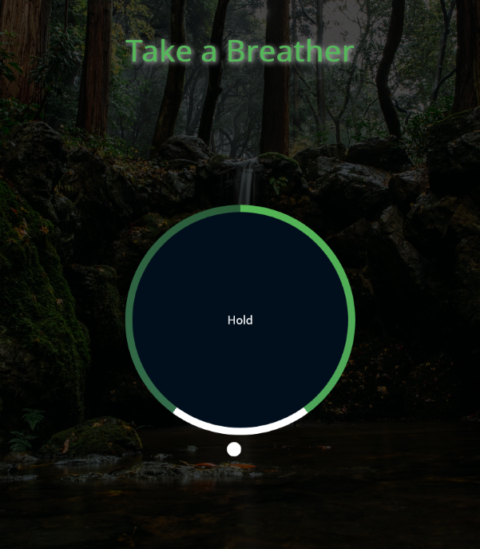

# Take a Breather - [Live Demo](https://rphase.github.io/justwebprojects/breather/)

A visual breathing aid telling when to breath in, hold, and breath out.

## Project Specifications

- Create circle and gradient circle with CSS
- Create and animate pointer (Small circle)
- Create grow and shrink animations
- Add JavaScript to create the breath animation effect
