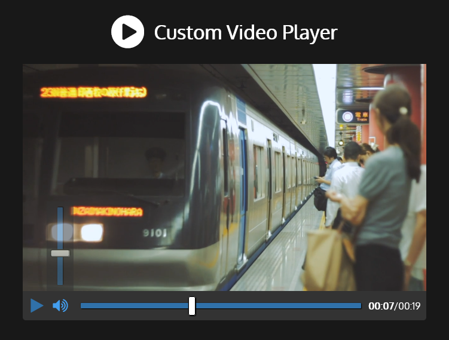

# Custom Video Player - [Live Demo](https://rphase.github.io/justwebprojects/custom-video-player)

Video player using the HTML5 video element and it's JavaScript API with a custom CSS design.

<!--  -->

## Project Specifications

- Display custom video player styled with CSS
- Play/Pause Button
- Click on video to pause/resume
- Video progress bar
- Set progress bar time (Seeking)
- Display time in mins and seconds
- Volume button with slider
- Doubleclick for fullscreen
