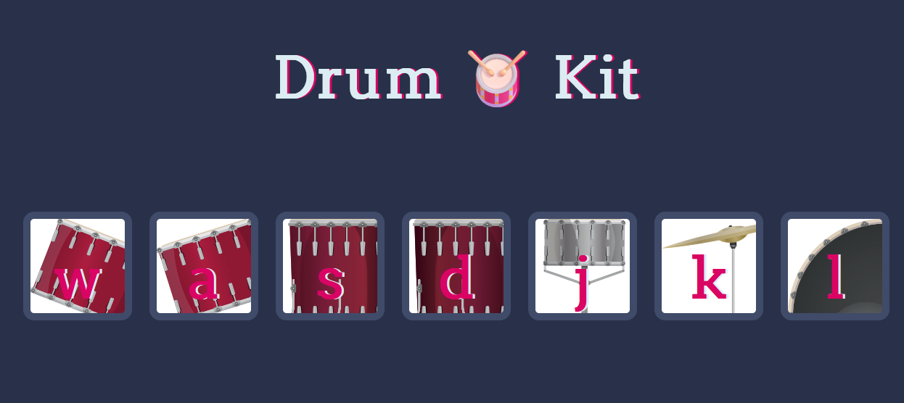

# Drum Kit - [Live Demo](https://rphase.github.io/justwebprojects/drumkit/)

A simple demo to play drum sounds

## Project Specifications

- Attach an event listener to `click` and `keydown` events for buttons to process audio elements
- Pressing or clicking on a key will play a drum sound
