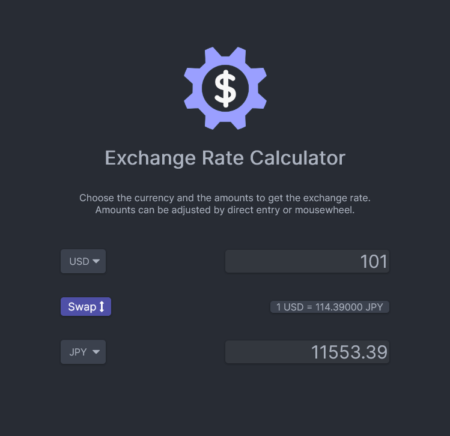

# Exchange Rate - [Live Demo](https://rphase.github.io/justwebprojects/exchange-rate/)

Simple exchange rate calculator. Choose from a list of currencies to convert.

## Project Specifications

- Display UI with 2 select lists for countries and 2 inputs for amounts
- Fetch exchange rates from [Exchange Rate API]
- Display the values for both countries
- Update values on amount change
- Swap country rates

[exchange rate api]: https://api.exchangerate-api.com
