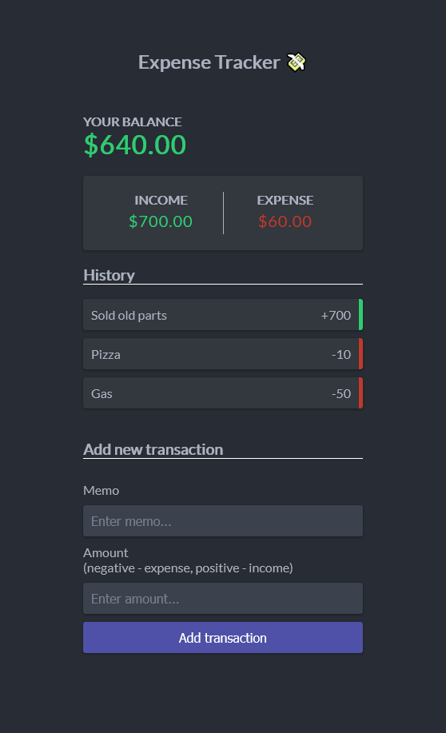

# Expense Tracker - [Live Demo](https://rphase.github.io/justwebprojects/expense-tracker/)

Track income and expenses by adding new transactions. History is stored to local storage.

## Project Specifications

- Create UI
- Display transaction items in DOM
- Show balance, expense and income totals
- Add new transation and reflect in total
- Delete items from DOM
- Persist to local storage
