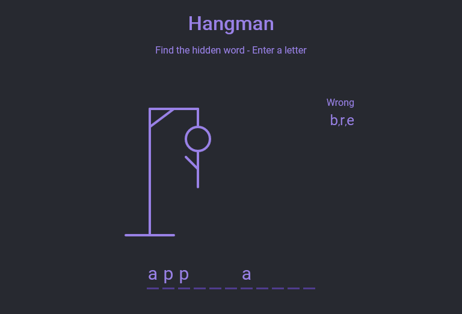

# Hangman - [Live Demo](https://rphase.github.io/justwebprojects/hangman/)

Hangman. Press any alphabet key to guess the letters of the a random word. Missed letters result in figure construction.

Win: All the letters of the word are found.

Lose: The figure is completed by missing too many letters.

Updated to fetch random words from an online API.

- Display hangman pole and figure using SVG
- Load a random word
- Display word in UI with correct letters
- Display wrong letters
- Show notification when selecting a letter twice
- Show popup on win or lose
- Play again button to reset game
- Get random words from [API](https://random-word-form.herokuapp.com)
