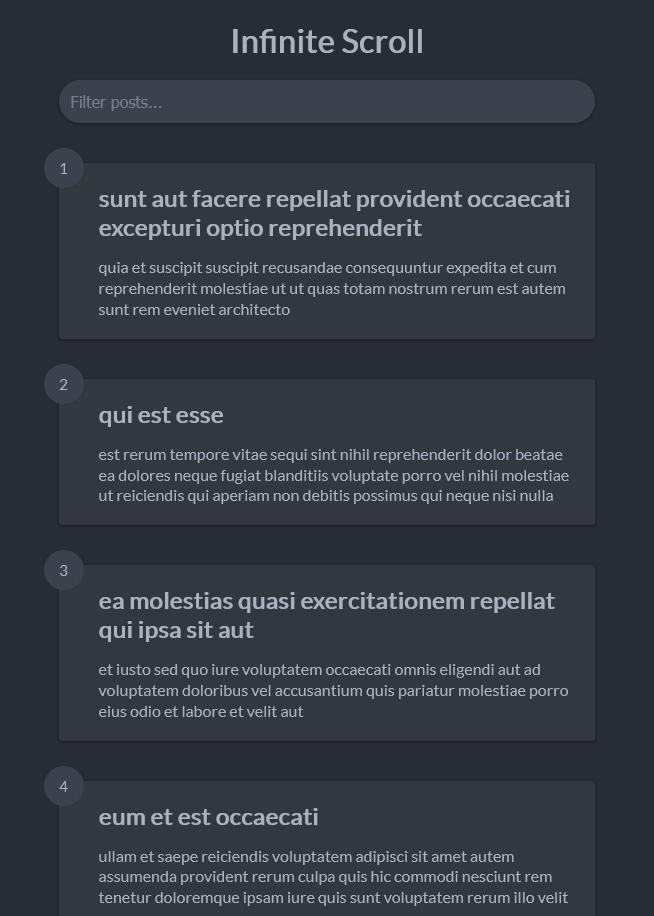

# Infinite Scroll - [Live Demo](https://rphase.github.io/justwebprojects/infinite-scroll/)

Infinite scrolling posts. Fetch and load 5 posts. When scrolling to the bottom, fetch another 5 posts.

Filter posts for matching post title or post body. Only filters currently loaded posts.

API used: https://jsonplaceholder.typicode.com/

## Project Specifications

- Create UI & custom CSS loader animation
- Fetch initial posts from API and display
- Scroll down, show loader and fetch next set of posts
- Add filtering for fetched posts

## References

https://javascript.plainenglish.io/how-to-implement-infinite-scroll-with-vanilla-javascript-f7733cdb026c
