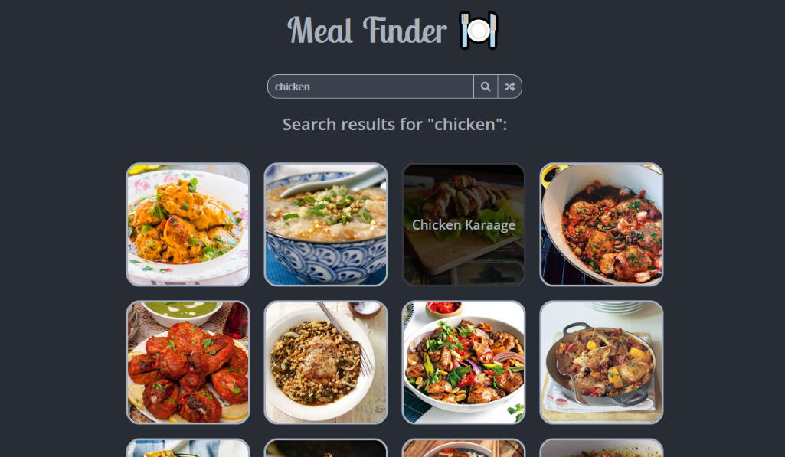
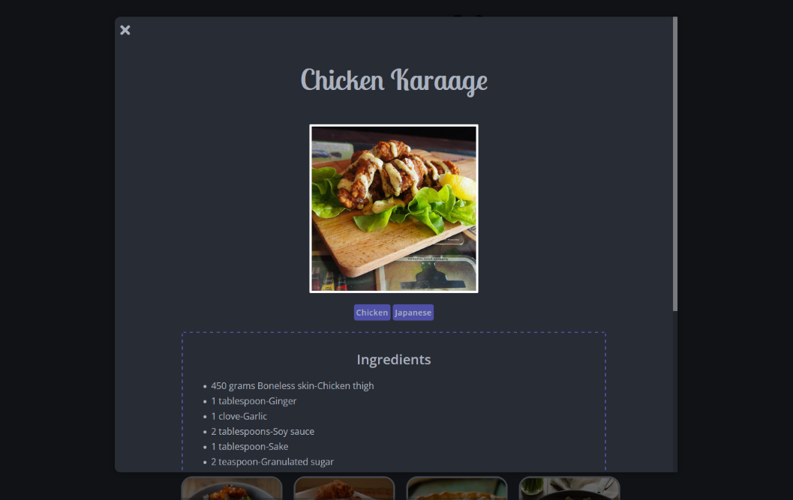

# Meal Finder - [Live Demo](https://rphase.github.io/justwebprojects/meal-finder)

Search for meals and display a recipe using an API.

## Project Specifications

- Display UI with search form and random generator button
- Connect to [TheMealDB API](https://www.themealdb.com) and get meals
- Display meals in DOM with image and hover effect
- Click on meal to see the details in modal object
- Click on generate button to fetch & display a random meal
