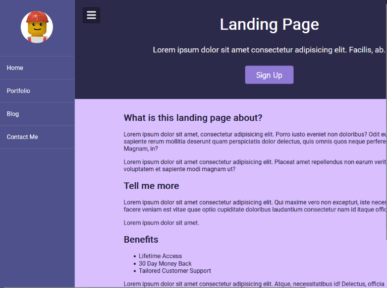

# Modal Menu Slider - [Live Demo](https://rphase.github.io/justwebprojects/modal-menu-slider/)

Example of a modal Sign Up prompt and sliding side menu with animations.

## Project Specifications

- Add event listeners to buttons to alter classes of DOM objects
- Show or hide modal based on CSS class
- Show or hide side bar based on CSS class
- Animate the side bar slide with CSS
