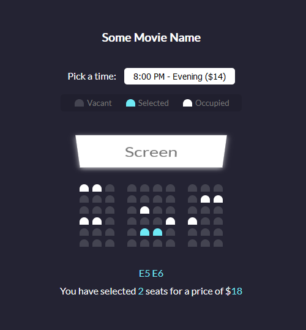

# Movie Seat Booking - [Live Demo](https://rphase.github.io/justwebprojects/movie-seat-booking)

Demo of movie seat selection prompt UI

## Project Specifications

- Programmatically generate and populate seats
- Assign each seat a code and event listener
- Update selected count and calculate total price when vacant seats are selected
- Save the current selected seats in localstorage for persistence
