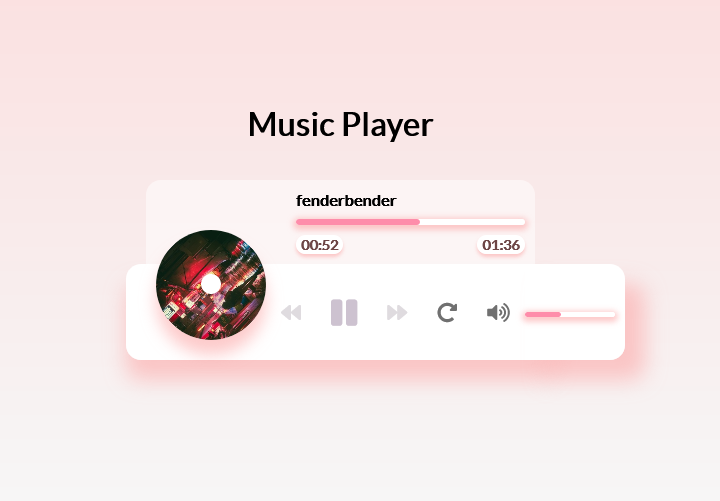

# Music Player - [Live Demo](https://rphase.github.io/justwebprojects/music-player/)

UI to play music stored in the music folder using the HTML5 audio API.

## Project Specifications

- Spinning disc image
- Song detail popup
- Add play and pause functionality
- Switch songs
- Progress bar and seeking
- Song duration and timestamp
- Volume control toggle and control
- Repeat button
